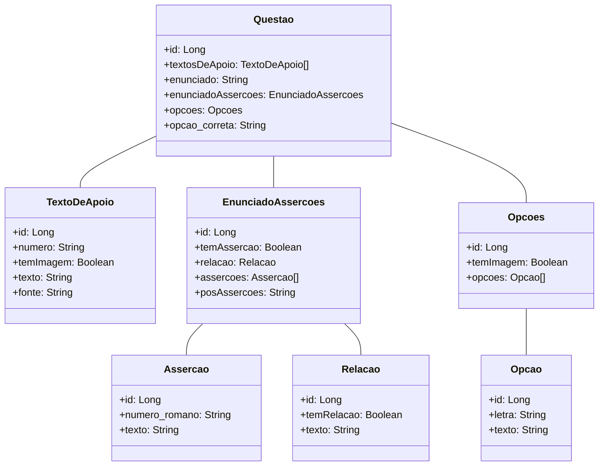

# primeiraapi
Desafio de primeira API da DIO.

```mermaid
classDiagram
    class Questao {
        +id: Long
        +textosDeApoio: TextoDeApoio[]
        +enunciado: String
        +enunciadoAssercoes: EnunciadoAssercoes
        +opcoes: Opcoes
        +opcao_correta: String
    }

    class TextoDeApoio {
        +id: Long
        +numero: String
        +temImagem: Boolean
        +texto: String
        +fonte: String
    }

    class EnunciadoAssercoes {
        +id: Long
        +temAssercao: Boolean
        +relacao: Relacao
        +assercoes: Assercao[]
        +posAssercoes: String
    }

    class Relacao {
        +id: Long
        +temRelacao: Boolean
        +texto: String
    }

    class Assercao {
        +id: Long
        +numero_romano: String
        +texto: String
    }

    class Opcoes {
        +id: Long
        +temImagem: Boolean
        +opcoes: Opcao[]
    }

    class Opcao {
        +id: Long
        +letra: String
        +texto: String
    }

    Questao -- TextoDeApoio
    Questao -- EnunciadoAssercoes
    Questao -- Opcoes
    Opcoes -- Opcao
    EnunciadoAssercoes -- Assercao
    EnunciadoAssercoes -- Relacao
```
